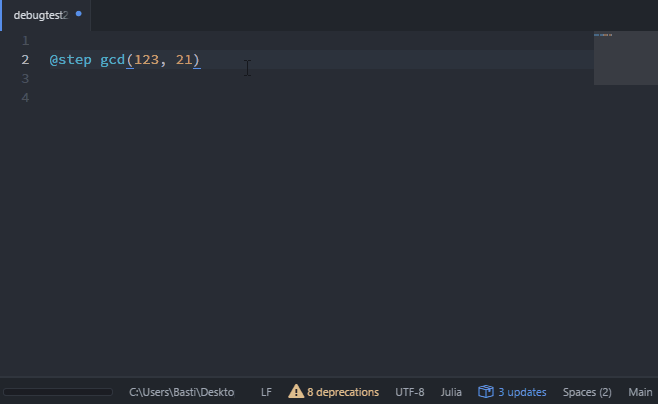

# Basic Usage

These instructions assume that you have already installed Juno. If you have not
installed Juno, please see the [Installation Instructions](@ref).

### Opening the Console Window

To open the console, use the command `Ctrl+j` then `Ctrl+o`, or go to Packages >
Julia > Open Console. This will open a window with the title console. To use the
console, simply type in a command and hit `Enter`. This will run the command in
Julia (the first time a command is run, the connection between Julia and Atom
will be installed, taking a bit more time). To clear the console, use the command
`Ctrl+j` followed by `Ctrl+c`.

Using the console is similar to using the REPL. For example, to enter multi-line
input, use `Ctrl+Enter`. Tab completion will be available with a window for selecting
the desired completion (which can be scrolled through using the arrow keys). Juno
also features enhanced displaying of output types. For example, types like `Array`
show an arrow on the side. By clicking on the header for this output you will
expand the array in the console. Note that floating point numbers truncate their
displays as well: to see more digits, click on the number.

### Inline Evaluation

You can evaluate your Julia code inline by navigating your cursor to the appropriate
code and hitting `Ctrl+Enter`. This will run the code block that the cursor is
contained in. For example, if you go to the top of a `for` loop, it will evaluate
the whole for loop, or if it's inside of a function, it will evaluate the function
(i.e. create the function). To specifically choose which code to evaluate, highlight
the appropriate parts and use `Ctrl+Enter`. To evaluate the whole script, use
`Ctrl+Shift+Enter`.

### The Command Panel

To open the command panel, use `Ctrl+Shift+p` or go to Packages > Command Pallete > Toggle.
In the command pallete you can search for common commands. For example, type in
"julia" and you will see the commands which relate to Julia (and the keyboard shortcuts
for the commands).

### Common Keyboard Shortcuts

For MacOS, replace `Ctrl` by `Cmd`.

- `Ctrl+Shift+p` - Open the command panel
- `Ctrl+Enter` - Evaluate at the cursor
- `Ctrl+Shift+Enter` - Evaluate the current file
- `Ctrl+j Ctrl+o` - Open the console
- `Ctrl+j Ctrl+c` - Clear the console
- `Ctrl+j Ctrl+s` - Start Julia
- `Ctrl+j Ctrl+k` - Kill the Julia process
- `Ctrl+j Ctrl+r` - Open a REPL
- `Ctrl+j Ctrl+p` - Open the Plot Pane
- `Ctrl+j Ctrl-d` - Get the documentation for the symbol under the cursor
- `Ctrl+j Ctrl-g` - Go to the definition of the symbol under the cursor

#### Adding Your Own Shortcuts

You can add custom commands and keybindings to julia, should you so wish. To do that, add something like the following to your `init.coffee`
```coffee
atom.packages.onDidActivatePackage (p) ->
  if p.name is 'julia-client'
    juno = p.mainModule

    atom.commands.add '.item-views > atom-text-editor', 'julia-client:clear-console-and-run-file', ->
      juno.runtime.evaluation.evalAll()
      juno.runtime.console.reset()

```
and
```cson
'.platform-win32 .item-views > atom-text-editor[data-grammar="source julia"]':
  'ctrl-shift-alt-enter': 'julia-client:clear-console-and-run-file'
```
to your `keymap.cson`. You can get to both files via Settings > Open Config Folder.

Note that you will need to muck around with julia-client's internals, so your code might break on new releases. You'll also need to figure out which functions you can use for what -- julia-client's [commands](https://github.com/JunoLab/atom-julia-client/blob/master/lib/package/commands.coffee) will probably be helpful for that.

### Using the Plot Pane

Use of the plot pane will be automatic by plotting packages which support the
interface. The following describes the package interactions in more depth.

#### The Plots.jl Ecosystem

Plots.jl supports usage of the plot pane with compatible backends. The backends
which are compatible are:

- PlotlyJS
- PyPlot
- GR

The `plot` command will plot to the plot pane by default. To open up a non-plot
pane window, use the `gui()` command. For example,

```julia
using Plots
pyplot() # Choose a backend
plot(rand(4,4)) # This will plot to the plot pane
gui() # This will open up a separate interactive GUI window
```

#### Gadfly

Gadfly also will use the plot pane.

### Using the Workspace Pane

A workspace pane is available for showing the variables declared in the workspace.
To open the pane, go to Packages > Julia > Open Workspace.

### Enhanced Rendering

Juno's enhanced rendering system makes it easy to view complex types and large
arrays by being able to fold the values. This is naturally done in the Juno
console, but is not shown for standard prints. In order to `print` using this
special rendering, use the `render` function from Juno.jl. Inside of a package
if you imported Juno, then the `render` function will be available. `render`
will also be available at the REPL.

For interactive usage inside of a module which does not import Main (i.e. during
package development), note that this function is automatically imported to `Main`
upon starting the Julia process, and thus can be accessed via `Main.Juno.render`.
For example, one can debug by adding print statements like:

```julia
Main.Juno.render(a)
```

and `a` will use the special Juno console rendering, even if the package does
not require/use Juno.jl.

### Using the Debugger (experimental)
Juno features an interactive debugger based on [Gallium.jl](https://github.com/Keno/Gallium.jl). The easiest way to access it to use the `Juno.@step` macro on a function call:



While you are stepping through a function, it's local variables will be displayed in the workspace and you can access them in the console (note, however, that it is *not* possible to assign to variables right now).

It is also possible to set a breakpoint (only via the `Juno.breakpoint` function for now), which will initialize the debugger at the breakpoint. `Juno.breakpoint` takes the same arguments as `Gallium.breakpoint`, so see [here](https://github.com/Keno/Gallium.jl#breakpointing-options) for a description.

### Settings

- **Julia Path**: The location of the Julia binary. This is the command that Atom uses to call Julia. It defaults to the command `julia` which requires that Julia has been added to the path. If Julia is not in the path, this must be the path to the Julia binary.
- **Boot Mode**: This is the type of process list that atom-julia-client is using.
  -  The default is `Basic`, which only has one process running at a time.
  - `Cycler` instead has a process queue per window, meaning that if you quit the REPL (`Ctrl+j`+ `Ctrl+o`) then there exists an already running process which will seamlessly replace it.
  - `Server` has a shared process queue between all windows, resulting in less processes (`2+n` vs `2n` where `n` is the number of windows), but is still experimental.
- **Deprecation Warnings**: Checkbox for whether to show the Julia deprecation warnings in the console.
- **Optimization Level**: Sets the `-O` optimization level for the Julia LLVM compiler. The default is `3` corresponding to `-O3` which is the default for the Julia REPL. Higher levels take longer to compile but produce faster code.
- **Enable Powershell Wrapper** (Windows only): Use a Powershell wrapper to spawn Julia. This is required in order to allow interrupts.
- **Notifications**: Enables popup notifications when the evaluation finishes.
- **Error Notifications**: When evaluating a script, this will show a popup when errors are encountered instead of only printing the error to the console.
- **Enable Menu**: Enables the Julia menu in the menu bar. This option requires a restart of Atom for the change to take effect.
- **Enable Tool Bar**: Shows the Julia icons in the tool bar. This option requires a restart of Atom for the change to take effect.
- **Maximum Console Size**: Limits the Console history's size (default: 10,000). A larger value will display more entries in the console at the cost of slowing down Atom.
- **Terminal**: The command which is used to open a new REPL.
