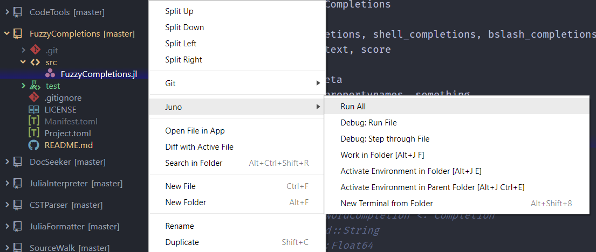

# Basic Usage

## Inline Evaluation

You can evaluate your Julia code inline by navigating your cursor to the code you want to evaluate and hitting `Ctrl+Enter` (i.e. `Julia Client: Run Block` command).
Juno will automatically detect an appropriate unit of code to run (i.e. code block) that the cursor is contained in, and then evaluate it.
For example, if you go to the top of a `for` loop, it will evaluate the whole for loop, or if it's inside of a function, it will evaluate the function (i.e. define the function).
To specifically choose which code to evaluate, select the appropriate parts and just use `Ctrl+Enter`.

`Shift+Enter` (`Julia-Client: Run-And-Move`) will do the same as `Ctrl+Enter` but also moves to the next code block.

### Fancy Inline Display

<!-- TODO -->

### In-Module Evaluation

The another important part of the Juno's inline evaluation is,
when you evaluate your code inline,
Juno will automatically try to detect the module in which the code lives in
and evaluate the code _in the module_.

This is very useful when you develop a package or even modify the language core like `Base` module, etc,
since you can interactively change code in a specific module and test it, very easily.
So in that sense, you can see Juno as an alternative of [Revise.jl](https://timholy.github.io/Revise.jl/stable/).

### Cell Evaluation

Juno also supports "cell-based" evaluation, which can be useful for the "notebook style programming" like what
[Jupyter Notebook](https://mybinder.org/v2/gh/binder-examples/demo-julia/master?filepath=demo.ipynb) provides.
A cell boundary is defined by a line starting with `##`, `#---`, `#%%`, or `# %%`.
You can easily navigate cells via `Alt+Up` (`Julia-Client: Prev-Cell`) and `Alt+Down` (`Julia-Client: Next-Cell`),
evaluate them with  `Alt+Enter` (`Julia-Client: Run-Cell`) or evaluate a cell and move to the next one via `Alt+Shift+Enter` (`Julia-Client: Run-Cell-And-Move`).

!!! tip
    You can have your own cell delimiters setting by changing `Julia Client > UI Options > Cell Delimiter` config.
    See [Juno Configurations](@ref) for more details.

!!! tip
    To convert your `.ipynb` file into a `.jl` script, which can be run by Juno,
    you have multiple choices like below:
    - [Weave.jl](http://weavejl.mpastell.com/stable/):
    - [Literate.jl](https://fredrikekre.github.io/Literate.jl/stable/):
    - [jupytext](https://jupytext.readthedocs.io/en/latest/?badge=latest):

    Juno also provides [Weave.jl integration](@ref), meaning you use evaluate inline (or even debug) `.jmd` file.
    We may add Literate.jl integration as well in the future.

### Script Evaluation

To evaluate the whole script, use `Ctrl+Shift+Enter` (`Julia-Client: Run-All`).

You can also use menus in the tree-view to run (or debug) a file:


### Activating the debugger

Activate the Juno debugger from the console like this:

```
Juno.@enter gcd(10, 20)
```

An editing pane will switch to the source for `gcd` and you will be able to step through it using
a debug controller or key bindings (see below). Your console which switches to a `debug>` prompt,
from which you can evaluate expressions that reference variables internal to `gcd`.

See [Debugging](@ref) for a step-by-step guide.

### Common Keyboard Shortcuts

For MacOS, replace `Ctrl` by `Cmd`.

- `Ctrl+Shift+p` - Open the command panel
- `Ctrl+Enter` - Evaluate at the cursor
- `Ctrl+Shift+Enter` - Evaluate the current file
- `Ctrl+j Ctrl+o` - Open the console
- `Ctrl+j Ctrl+c` - Clear the console
- `Ctrl+j Ctrl+s` - Start Julia
- `Ctrl+j Ctrl+k` - Kill the Julia process
- `Ctrl+j Ctrl+r` - Open a REPL
- `Ctrl+j Ctrl+p` - Open the Plot Pane
- `Ctrl+j Ctrl-d` - Get the documentation for the symbol under the cursor
- `Ctrl+j Ctrl-g` - Go to the definition of the symbol under the cursor

When debugging,

- `F10` - advance to next expression
- `F11` - step into function call
- `Shift-F11` - step out of function call

#### Adding Your Own Shortcuts

You can add custom commands and keybindings to julia, should you so wish. To create new commands, add something like the following to your `init.coffee`
```coffee
atom.packages.onDidActivatePackage (p) ->
  if p.name is 'julia-client'
    juno = p.mainModule

    atom.commands.add '.item-views > atom-text-editor', 'julia-client:clear-console-and-run-file', ->
      juno.runtime.evaluation.evalAll()
      juno.runtime.console.reset()

```
and
```cson
'.platform-win32 .item-views > atom-text-editor[data-grammar="source julia"]':
  'ctrl-shift-alt-enter': 'julia-client:clear-console-and-run-file'
```
to your `keymap.cson` (you can get to both files via Settings > Open Config Folder). It's also possible to add new keybindings for existing commands, such as `f5` for `julia-client:run-file`.

Note that you will need to muck around with julia-client's internals for defining custom commands, so your code might break on new releases. You'll also need to figure out which functions you can use for what -- julia-client's [commands](https://github.com/JunoLab/atom-julia-client/blob/master/lib/package/commands.coffee) will probably be helpful for that.

### Using the Plot Pane

Use of the plot pane will be automatic by plotting packages which support the
interface. The following describes the package interactions in more depth.

#### The Plots.jl Ecosystem

Plots.jl supports usage of the plot pane with compatible backends. The backends
which are compatible are:

- [PlotlyJS](https://github.com/sglyon/PlotlyJS.jl)
- [PyPlot](https://github.com/JuliaPy/PyPlot.jl)
- [GR](https://github.com/jheinen/GR.jl)

The `plot` command will plot to the plot pane by default. To open up a non-plot
pane window, use the `gui()` command. For example,

```julia
using Plots
pyplot() # Choose a backend
plot(rand(4,4)) # This will plot to the plot pane
gui() # This will open up a separate interactive GUI window
```

#### Other plotting packages

These packages are compatible with Juno and will also use the plot plane:

- [Gadfly](https://github.com/GiovineItalia/Gadfly.jl)
- [Gaston](https://github.com/mbaz/Gaston.jl)

### Using the Workspace Pane

A workspace pane is available for showing the variables declared in the workspace.
To open the pane, go to Packages > Julia > Open Workspace.
