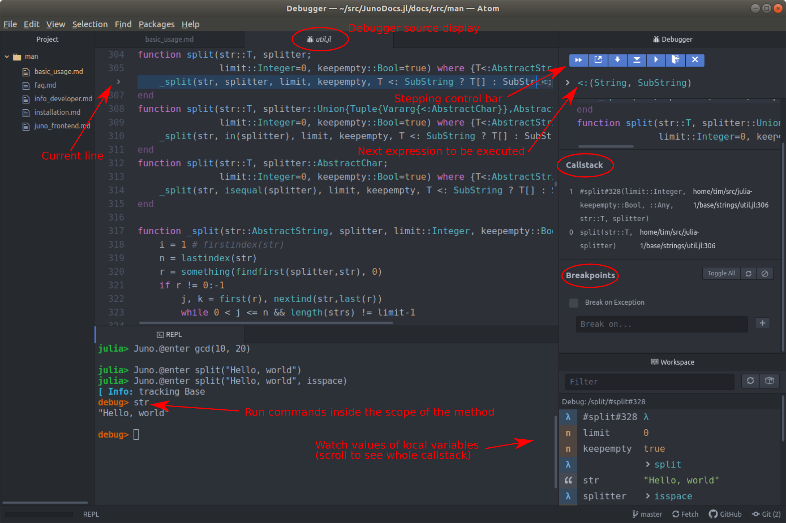

# Debugging

Open a console and type `Juno.@enter split("Hello, world", isspace)`.
You should see something like the following (without the red annotations):

(Your arrangement of panes may be different, but if you wish you can adjust these to match.) Some of the key features of this display are annotated
in red. We're going to walk through some of these item-by-item.

The first thing to note is that a window has opened to `util.jl`, with
a little "bug icon" next to it. This is a view of the source code that
defines the `split` function you've entered into. Execution is paused
at the first line, a call to `_split.`

Now turn your attention to the upper right. There are two key elements there,
a control bar and a display of the next statement to be executed.
Try hovering over the buttons on the control bar to get a sense for what
they do (we'll use some of them in a minute).

Notice that the "next expression" display does *not* show `_split`; instead,
it's `<:(String, SubString)`, which originates from a portion of that first
line, in the source written as `T <: SubString`. (`T` is a type parameter,
the type of `str` which here is `String`.)
This is an indication that before calling `_split`, we have to do a bit of
preliminary work.

In the control bar, find the button for "Next Expression" and click it.
While the line in the source code display (the pane with `util.jl`) doesn't
change its location, you can see an update in the next expression to be executed,
now `apply_type(SubString, String)`, meaning it will be executing the `SubString{T}`.

Continue to press "Next Expression" until the call to `_split`
is queued up. Then press the button just to the right, "Step into Function".
Now you'll see a change in the source window, a jump to a new execution point
within `_split`.

Now let's turn our attention to a few other elements.
The "Callstack" pane to the right should show a chain of calls; the first one
(the one we entered) is at the bottom, and the current one is at the top.
In this particular case you'll note a strange entry, something along
the lines of `#split#328` (the specific number may be different for you).
This is revealing some of the internals of how Julia handles functions that
have keyword arguments. To keep things from getting too tedious, the debugger
stepped over some of the preparatory steps needed to construct the appropriate
keyword arguments, but you can see the evidence in the callstack.

Below the Callstack pane is a very important pane, "Breakpoints."
Breakpoints allow you to skip over many lines without stepping, and then
stop at a particular line. You can set breakpoints in the console using the
[commands implemented by JuliaInterpreter](https://juliadebug.github.io/JuliaInterpreter.jl/stable/),
but perhaps easier is to click in the leftmost column.
You'll see this location gets added to the list (previously empty) of
breakpoints on the right hand side.

Up in the Debugger control bar, click the double-arrows indicating "Continue."
You should see the execution jumps to the position of the breakpoint;
the values of variables in the Workspace plane also update to reflect
the new state.

In the Breakpoint panel, here are some fun things to try:

- uncheck the box next to this breakpoint location; you should see the red
  dot to the left of the source line dim. This is an indication that you've
  `disable`d this breakpoint; it hasn't been forgotten, but you've made it
  inactive (the fact that it hasn't been forgotten can be especially
  useful in conjunction with conditional breakpoints, discussed next).
  Click the box again to reactivate it.
- click the icon that looks like a fork in the road ("Edit Condition").
  A dialog should open
  asking you to insert a breakpoint condition. The workspace indicates that
  `j` has a value of 7; type in `j > 8` and click "Confirm."
  Note that the icon next to that source line has turned blue, indicating
  a conditional breakpoint. Given the condition on `j` you entered
  and the fact that the input string does not have any spaces at
  positions higher than 7, this breakpoint would not have been hit.

  To try out your new conditional breakpoint, first exit debugging by
  clicking the "x" in the Debugger control bar.
  Your console should
  return to the normal `julia>` prompt; now, enter
  `Juno.@run split("Hello there, world", isspace)`,
  where `@run` is like `@enter` followed by clicking "Continue".
  You'll return to the breakpoint, but now `j==13`
  and the first substring, "Hello," has already been entered into `strs`.
  This demonstrates that you already completed the first iteration of this
  `while` loop before the condition was satisfied.
- Exit debugging again and click the "Clear Breakpoints"
  Check the "Break on Exception". Then enter an expression that would
  normally trigger an error: `Juno.@enter convert(UInt, -8)`.
  (You can't convert a negative number to a `UInt`.)
  Click "Continue." You should advance to a
  method, `throw_inexacterror`. Examine the Callstack pane to see the chain of
  calls that got you here.

This isn't an exhaustive overview of debugging in Juno, but hopefully it's
enough to help you get started exploring on your own.
