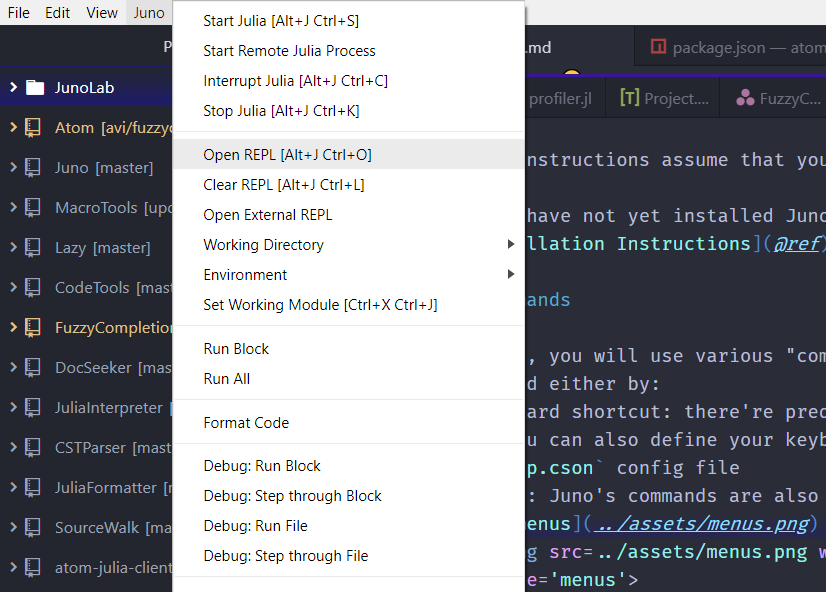
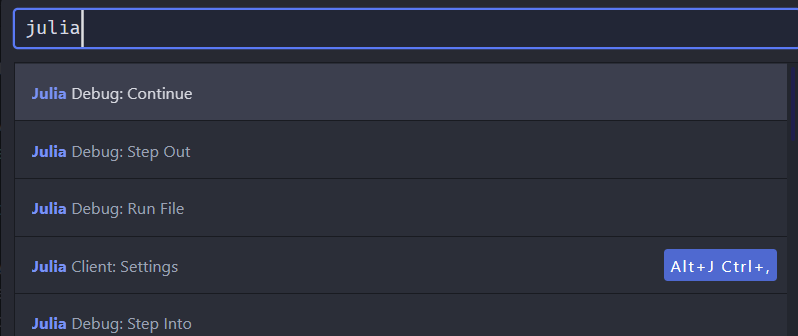
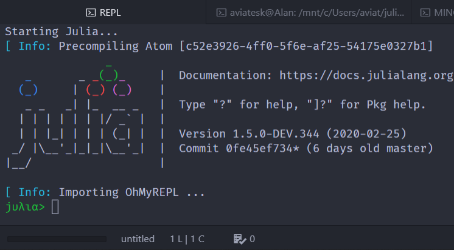
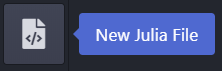
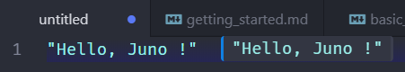

# Getting Started

All the following instructions assume that you have already installed Juno.
If you have not yet installed Juno, please see the [Installation Instructions](@ref).

## Commands

In Juno, you will use various "commands", which can be invoked either by:
- **keyboard shortcut**: there're predefined keyboard shortcuts and you can also define your keyboard shortcuts via `keymap.cson` config file
- **menus**: Juno's commands are also accessible via `Juno` menu
  * 
- **the command palette**:
  you can use this to search and invoke commands -- for example, if you type in `"julia"`,
  you will see commands that relate to Julia and their keyboard shortcuts.
  To open the command palette, use `Ctrl+Shift+P` shortcut or `Packages > Command Palette > Toggle` menu
  * 

!!! note
    As you might already have noticed, in this documentation we gonna use the notations below:
    - `Key` represents a keyboard shortcut
    - `Pkg > Menu`: represents a menu
    - `Pkg: Command`: represents a command

!!! note "Keyboard Shortcut For macOS"
    If you're a macOS user, replace all the `Ctrl` with `Cmd`
    for the keyboard shortcut keys in this instruction.

Here, as a first step, let's open Juno's REPL either by:
- keyboard shortcut: `Ctrl+J Ctrl+O`
- menus: `Juno > Open REPL`
- command palette: search and hit the `Julia Client: Open REPL` command

!!! tip
    You can see all the predefined keyboard shortcuts in `File > Settings > Keybindings`,
    and also can define your own keyboard shortcuts by customizing your
    [`.atom/keymap.cson`](https://flight-manual.atom.io/using-atom/sections/basic-customization/) config file,
    which can be opened via `File > Keymap...` (`Application: Open-Your-Keymap`).
    
    [The keybinding resolver pane](https://atom.io/packages/keybinding-resolver),
    which will be opened via `Key Binding Resolver: Toggle` command,
    can be useful to watch on which command you're using at a time.
  
    You can also define _your own commands_ and even a shortcut for it.
    See [Adding Your Own Shortcuts](@ref) for the details if interested.

## Start Julia

Most of Juno's features are provided by Julia's runtime –
meaning **you need to boot Julia first** in order to use the power of Juno like inline evaluation, auto-completions, etc.

You can start Julia by just hitting `Enter` in Juno REPL, which we just have opened in the previous section.
Once you've started Julia, REPL will show the familiar welcome banner and  the progress bar should appear in the status-bar:

Now you're good to use all the Juno features.

!!! note
    The command `Julia Client: Start Julia` (`Ctrl+J Ctrl+S` or `Juno > Start Julia`)
    will also start Julia, but won't open Juno's REPL,
    where you can check outputs in `stdout`, use `pkg>` mode, etc.

    When your Julia runtime gets messed or you just want simply to restart Julia process,
    you can use `Julia Client: Kill Julia` (`Ctrl+J Ctrl+K` or `Juno > Stop Julia`), and then start Julia again.

## Hello Juno !

Let's start to play around with Juno in the traditional way:
- create and open an new Julia file by clicking the icon in a toolbar
  * 
  * or if you've not enabled the tool-bar, you can just use `Julia: New Julia File` command
- type `println("Hello, Juno !")` anywhere into the editor
- use the shortcut key `Ctrl+Enter`
- now your REPL should show the output `Hello, Juno !`

Next, change the line into `"Hello, Juno !"` and hit `Ctrl+Enter` again;
this time we won't see the output in REPL but still we get the inline output in the editor instead:

This is one of the many features of Juno to help us develop a code.

Alright, let's move on to the next section and see the [Basic Usage](@ref) of Juno.
